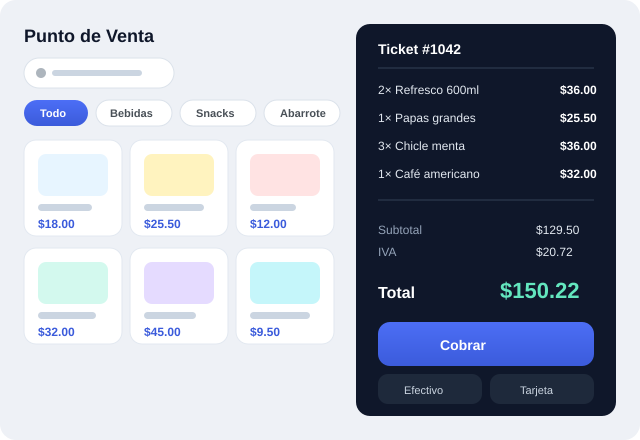

# Digitaliza Qro: Landing page

Sitio web de una sola página para ofrecer soluciones de digitalización a pequeños
negocios: **Cartera & Cobranza**, **Punto de Venta** y **Sistema de Citas**.

Hecho con HTML, CSS y JavaScript puro, **sin dependencias ni pasos de compilación**.
Se puede publicar tal cual en GitHub Pages, Netlify, Vercel o cualquier hosting estático.

## Estructura

```
├── index.html        # Toda la estructura de la página
├── styles.css        # Diseño y estilos
├── script.js         # Menú móvil, animaciones y contadores
└── assets/
    ├── logo.svg              # Logo (fondo claro)
    ├── logo-light.svg        # Logo (fondo oscuro, footer)
    ├── favicon.svg
    ├── hero-dashboard.svg    # Imagen principal
    ├── mockup-cartera.svg    # Captura simulada de Cartera & Cobranza
    ├── mockup-pos.svg        # Captura simulada de Punto de Venta
    └── mockup-citas.svg      # Captura simulada de Sistema de Citas
```

## Ver la página en local

Abre `index.html` directamente en el navegador, o levanta un servidor local:

```bash
python3 -m http.server 8000
# luego abre http://localhost:8000
```

## Reemplazar los mockups por capturas reales

Las imágenes en `assets/` son **mockups con datos ficticios** (para no exponer
información de tus clientes). Cuando tengas capturas reales de tus sistemas:

1. Toma la captura procurando que **no aparezcan datos sensibles** de clientes.
2. Guárdala en `assets/` (PNG o JPG).
3. En `index.html`, cambia la ruta del `src` correspondiente. Por ejemplo:
   ```html
   <!-- antes -->
   
   <!-- después -->
   
   ```

## Datos que puedes personalizar

- **WhatsApp / teléfono:** busca `524271492766` (WhatsApp) y `+524271492766`
  (llamadas) en `index.html` y reemplázalos si cambia el número.
- **Marca:** el nombre "Digitaliza Qro" está en el logo (`assets/logo*.svg`),
  el `<title>` y el footer.
- **Textos:** todo el contenido está en `index.html`, bien identificado por secciones.

## Publicar en GitHub Pages

En el repositorio: **Settings → Pages → Build and deployment → Source: Deploy from
a branch**, elige la rama y la carpeta `/root`. En un par de minutos queda en línea.
